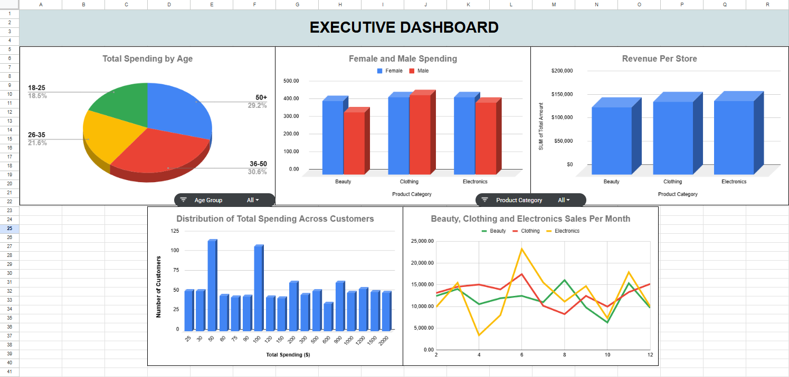

# 🛍️ Retail Sales Analysis

This project analyzes retail sales data, from a [Kaggle Dataset](https://www.kaggle.com/datasets/mohammadtalib786/retail-sales-dataset), using **SQL, Excel, and Tableau** to uncover customer purchasing trends and insights. The dataset contains details about transactions, customers, products, and sales performance.

## 🔍 Steps:
- **📂 Data Gathering:** SQL is used to extract and generate insights from the dataset.
- **📊 Data Analysis:** Excel is used for pivot tables and advanced data analysis.
- **📈 Visualization:** Tableau is used to create dynamic, interactive dashboards.

## 📑 Dataset:
The dataset includes columns such as **Transaction ID, Date, Customer ID, Gender, Age, Product Category, Quantity, Price per Unit, and Total Amount.**

## 🎯 Project Goals:
- Analyze customer behavior based on age and gender.
- Explore sales trends over time and across product categories.
- Build interactive dashboards to present findings.

## 🔑 Key Insights:
- **Currency:** The money values are assumed to be in USD.
- **Top Spending Customers:** Multiple customers have total spendings of **$2000.**
- **Lowest Spending Customers:** Multiple customers have total spendings of **$25.**

### Best-Selling Products by Total Sales:
- **Electronics:** 156,905 units
- **Clothing:** 155,580 units
- **Beauty:** 143,515 units

### Top-Selling Products by Purchase Count:
- **Clothing:** 351 purchases
- **Electronics:** 342 purchases
- **Beauty:** 307 purchases

### Average Price per Unit (Rounded):
- **Beauty:** $184.06
- **Electronics:** $181.90
- **Clothing:** $174.29

### Total Sales by Gender:
- **Women:** 232,840 units
- **Men:** 223,160 units

### Total Sales by Age Group:
- **36-50:** 139,660 units
- **50+:** 133,310 units
- **26-35:** 98,480 units
- **18-25:** 84,550 units

These insights have been exported as **CSV files** for further analysis, including pivot tables and Tableau visualizations.

---

## 📊 Executive Dashboard
A [**dynamic Excel dashboard**](https://docs.google.com/spreadsheets/d/1DQKo8S9sNxvSJi8YkrgP2SEcmIKWsrSP0-sBs_7UghI/edit?gid=1796610357#gid=1796610357) has been created to provide visual insights. The dashboard contains **multiple charts and slicers** to allow users to explore data based on different metrics such as **age group and product category.**

---

## 📊 Tableau Dashboard
An **interactive Tableau dashboard** visualizes key insights from the retail sales data. Users can explore **customer purchasing patterns, sales trends, and product performance** with interactive filters.

[**View the Live Tableau Dashboard**](https://public.tableau.com/views/RetailDashboard_17410166538060/Dashboard1?:language=en-US&:sid=&:redirect=auth&:display_count=n&:origin=viz_share_link)

## 📌 Conclusion  
This project provides valuable insights into customer purchasing behavior, sales trends, and product performance using SQL, Excel, and Tableau. By analyzing the data, I identified key patterns in spending, top selling products, and customer demographics. The interactive dashboards allow for simple exploration of these insights, making it easy to derive data-driven decisions. Future improvements could include incorporating time series forecasting, deeper analysis, or integrating additional datasets to enhance the analysis further.  

